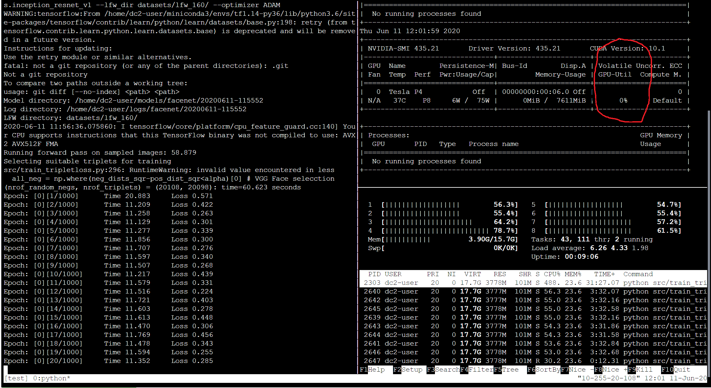
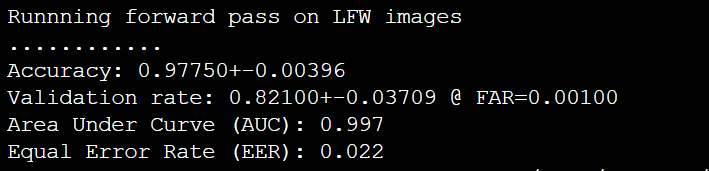
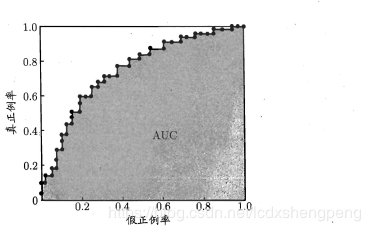
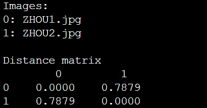
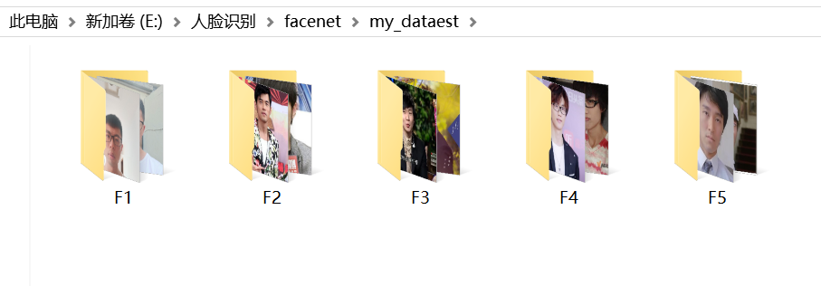
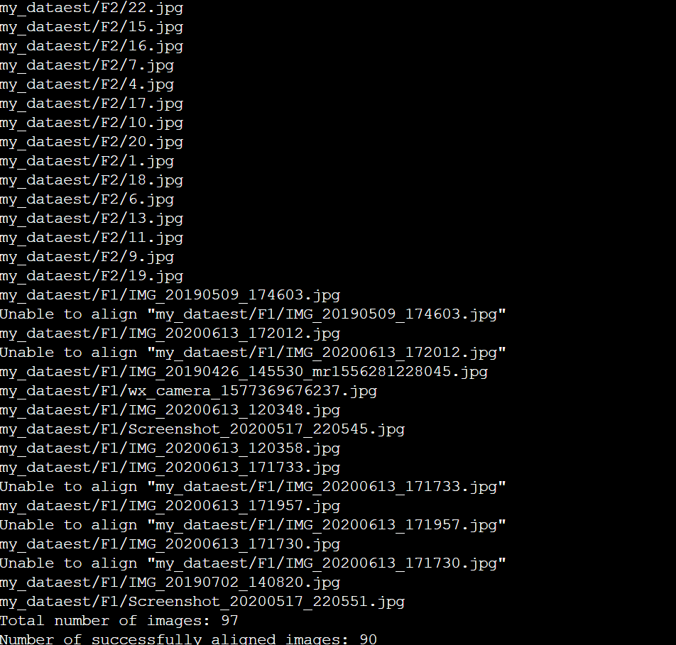
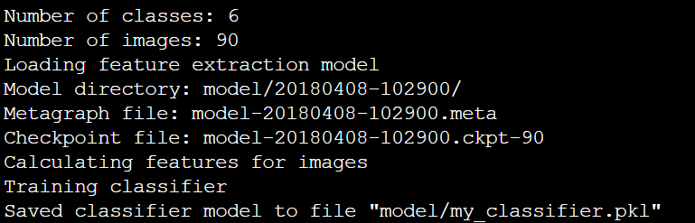
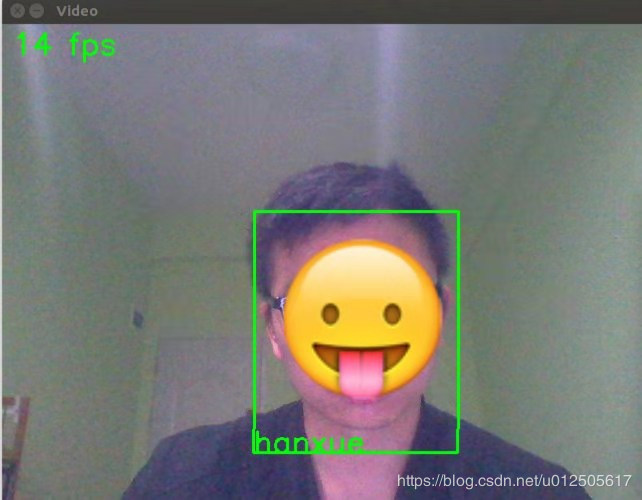

# 1. 对齐训练数据和检验数据（预处理）
## align_dataset_mtcnn.py

### `python src/align/align_dataset_mtcnn.py datasets/lfw/ datasets/lfw_160 --image_size 160 --margin 32 --random_order --gpu_memory_fraction 0.25`

### `python src/align/align_dataset_mtcnn.py datasets/CASIA-WebFace/ datasets/CASIA-WebFace_160 --image_size 160 --margin 32 --random_order --gpu_memory_fraction 0.25`

###出现问题：module 'scipy.misc' has no attribute 'imread'

###解决：`pip install scipy==1.2.1`

#2. 训练
##train_tripletloss.py

    
###    CUDA_VISIBLE_DEVICES=0 python src/train_tripletloss.py --data_dir datasets/CASIA-WebFace_160/ --image_size 160 --model_def models.inception_resnet_v1 --lfw_dir datasets/lfw_160/ --optimizer ADAM

### 添加 
## `import OS`
## `os.environ["CUDA_VISIBLE_DEVICES"] = '0'`
    
# 3. 检验 
#`**validate_on_lfw.py**`

###    python src/validate_on_lfw.py datasets/lfw_160/ model/20180408-102900/

###AUC（Area Under Curve）被定义为ROC曲线下与坐标轴围成的面积,AUC越接近1.0，检测方法真实性越高.
##它的纵轴为真正例率TPR(True Positive Rate),横轴为假正例率FPR(False Positive Rate)，分别定义为：
 

###在ROC曲线上将坐标点（0，1）和（1，0）连接起来，与ROC曲线的交点所对应的FPR值就是EER 

#4.测试
##comare.py

###  运行
###` python src/compare.py model/20180408-102900 ZHOU1.jpg ZHOU2.jpg`

###Embedding的特征向量=0.7879<1,因此判断为同一人。

# 5. 制作自己的人脸识别库
### 1）构建自己的数据集

### 2) 通过align_dataset_mtcnn.py进行对齐，并把人脸图片尺寸裁剪至 160*160

###  `python src/align/align_dataset_mtcnn.py my_dataest/ my_dataest/my_dataest_160 --image_size 160 --margin 32 --random_order --gpu_memory_fraction 0.25`

### 3) 制作人脸识别库- classifier.py TRAIN
### 训练一个人脸识别库，在facenet/model/ 目录下my_classifier.pkl 文件
###`python src/classifier.py TRAIN my_dataest/my_dataest_160/ model/20180408-102900/ model/my_classifier.pkl`

### 4）验证- classifier.py CLASSIFY
###   ` python src/classifier.py CLASSIFY my_dataest/my_dataest_160/ model/20180408-102900/ model/my_classifier.pkl`

.png)
###说明在训练集上的准确率为100%。

### 5）预测- predict.py
###`python src/predict.py my_dataest/x.jpg model/20180408-102900/ model/my_classifier.pkl --gpu_memory_fraction 0.25`
.png)
###正确
.png)
###正确识别出是F1这个人，但确信度不大，可能自己照片的质量不佳以及未严格裁剪160*160导致

###6）使用摄像头实时识别
###拷贝contributed目录下的 face.py和real_time_face_recognition.py文件放到src目录下

###把 face.py代码里的

    facenet_model_checkpoint = os.path.dirname(__file__) + "/../model_checkpoints/20170512-110547"
    classifier_model = os.path.dirname(__file__) + "/../model_checkpoints/my_classifier_1.pkl"
    
改为：
    
    facenet_model_checkpoint = os.path.dirname(__file__) + "/../models/20180402-114759"
    classifier_model = os.path.dirname(__file__) + "/../models/my_classifier.pkl"

### 运行 `python src/real_time_face_recognition.py`
.png)
###当然在云平台Linxu命令行打开摄像头比较难，会出现错误，于是放弃了。
###网上找了张效果图看看。

## 6. FaceNet人脸登陆 （Python-Web实现 ）
###参考：[https://github.com/xvshu/face_login](https://github.com/xvshu/face_login)

### 在face_mysql.py文件中 （第12行 配置数据库用户名、密码、地址、数据库地址 本案例配置如下
###` db = mysql.connector.connect(user='root', password='root', host='127.0.0.1', database='face')`
### 在face_recognition_api.py的59行：
### modelpath = "D:\\gitproject\\AI\\人脸识别\\facenet_regonistant\\models\\facenet\\20170512-110547"改成自己模型的路径
### 命令行运行 `python  face_recognition_api.py`
### 访问地址是XXXXXX:8080
